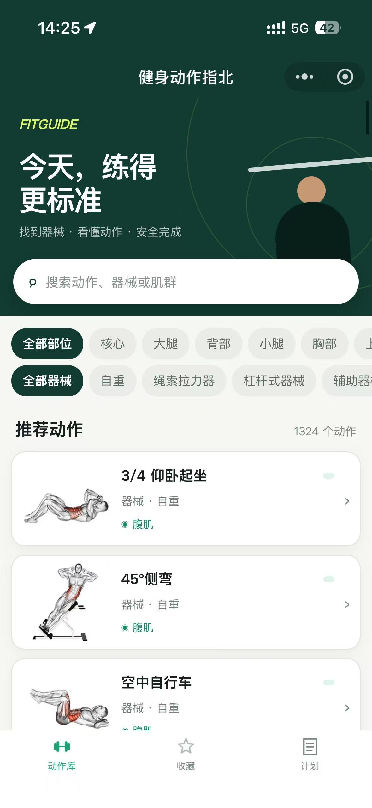
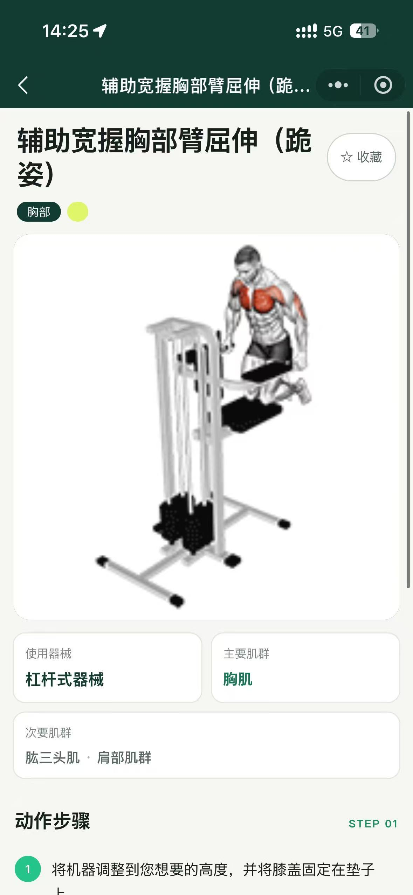
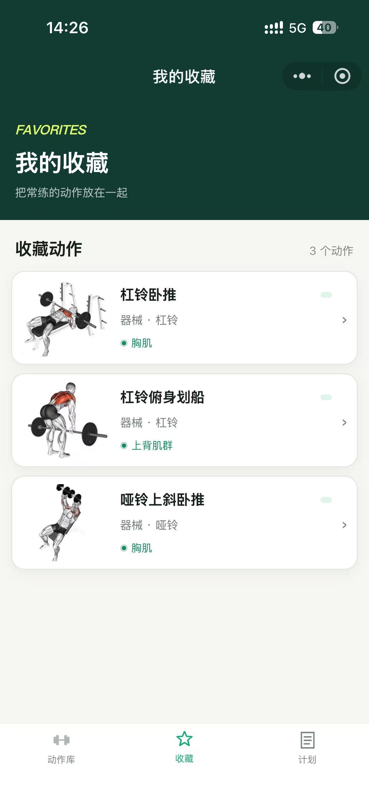
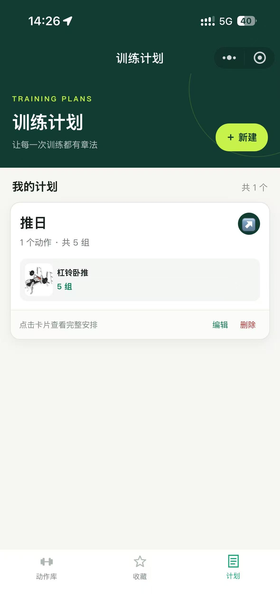
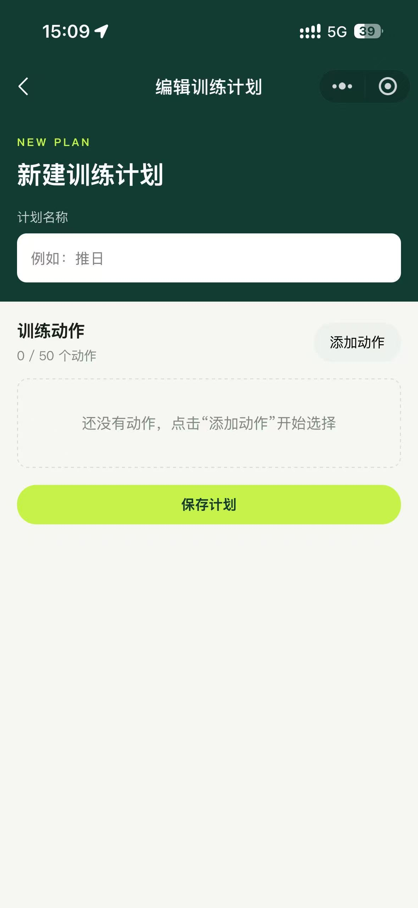
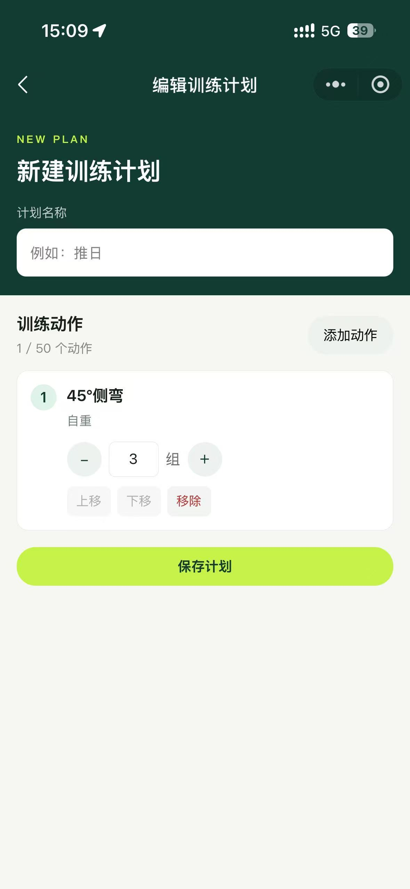
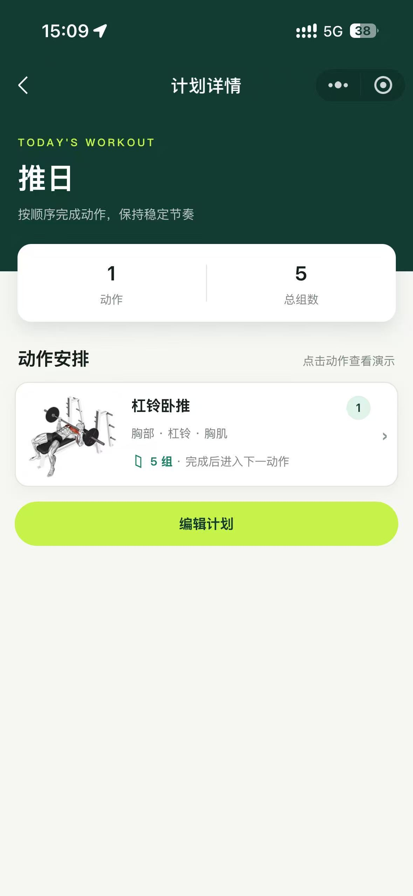

<div align="center">

# FitGuide

**面向健身新手的微信动作指南：找动作、看演示、存收藏、排计划。**

<p>
  
  
  
  
</p>

</div>

FitGuide 由微信原生小程序和 Spring Boot 后端组成。小程序内置 **1324 条中文健身动作**，覆盖 **10 个训练部位**和 **28 种器械**，支持搜索筛选、动作演示、云端收藏和训练计划管理。

动作目录直接随小程序加载，浏览、筛选和查看详情不依赖后端；收藏与训练计划通过微信云托管获取 OpenID，并同步到 MySQL。

> [!IMPORTANT]
> 动作数据与媒体来自 [hasaneyldrm/exercises-dataset](https://github.com/hasaneyldrm/exercises-dataset)。来源项目的代码与数据采用 MIT License；图片、GIF 等媒体版权归 [GymVisual](https://gymvisual.com/) 所有，不属于 MIT 授权范围。

## 应用截图

### 动作浏览与收藏

<table>
  <tr>
    <th align="center">动作库</th>
    <th align="center">动作详情</th>
    <th align="center">我的收藏</th>
  </tr>
  <tr>
    <td align="center"></td>
    <td align="center"></td>
    <td align="center"></td>
  </tr>
</table>

### 训练计划

<table>
  <tr>
    <th align="center">计划列表</th>
    <th align="center">新建计划</th>
    <th align="center">配置动作</th>
    <th align="center">计划详情</th>
  </tr>
  <tr>
    <td align="center"></td>
    <td align="center"></td>
    <td align="center"></td>
    <td align="center"></td>
  </tr>
</table>

## 主要功能

- **动作库**：按动作名、器械或肌群搜索，并按训练部位与器械组合筛选。
- **动作详情**：查看主要/次要肌群、动作步骤、注意事项、静态图和 GIF 演示；动图失败时回退到静态图并支持重试。
- **云端收藏**：使用微信 OpenID 跨设备保存常练动作，并兼容旧版本地收藏迁移。
- **训练计划**：新建、编辑和删除计划；筛选添加动作、调整顺序，并为每个动作设置组数。
- **计划详情**：汇总动作数与总组数，按训练顺序展示动作，并可直接进入动作演示。
- **微信分享**：所有页面支持分享给好友和朋友圈，分享入口统一回到动作库首页。
- **异常处理**：覆盖空结果、无效动作、失效计划项、媒体加载失败和云服务异常状态。

## 项目架构

```text
微信小程序
├── data/exercises.js ───────────── 本地动作目录（列表、筛选、详情）
├── 对象存储 ────────────────────── JPG / GIF 动作媒体
└── wx.cloud.callContainer ──────── 云托管注入 X-WX-OPENID
                                      │
                                      ▼
                              Spring Boot API
                                      │
                                      ▼
                              MyBatis-Plus / MySQL
                              ├── 用户收藏
                              └── 训练计划
```

后端仍保留 MySQL 动作目录接口，便于独立调用；当前小程序的动作列表与详情使用本地数据，不请求这些目录接口。

## 技术栈

| 模块 | 技术与职责 |
| --- | --- |
| 微信小程序 | 原生 WXML、WXSS、JavaScript（CommonJS） |
| 动作目录 | 本地 JSON / CommonJS，共 1324 条动作 |
| 动作媒体 | HTTPS 对象存储，同时兼容 CloudBase `cloud://` fileID |
| 后端 | JDK 21、Spring Boot 3.5.9、Maven |
| 数据访问 | MyBatis-Plus 3.5.15、MySQL 5.7 |
| 接口文档 | SpringDoc OpenAPI 2.8.9 / Swagger UI |
| 部署 | 微信云托管、Docker 多阶段构建 |
| 检查 | Node.js `assert` 脚本、JUnit 5、MockMvc、Mockito |

## 快速开始

### 1. 运行小程序

准备 [微信开发者工具](https://developers.weixin.qq.com/miniprogram/dev/devtools/download.html) 和一个可用的小程序 AppID：

```bash
git clone https://github.com/lfm666/FitGuide.git
cd FitGuide
```

在微信开发者工具中导入 `fit-guide-miniprogram` 目录并编译。小程序没有 npm 依赖，无需执行 `npm install`；动作库、搜索筛选和详情页可直接使用。

如需使用云端收藏与训练计划，还需要：

1. 在 `fit-guide-miniprogram/utils/api.js` 中替换 `ENV_ID` 和 `SERVICE_NAME`。
2. 初始化 MySQL 并部署 `fit-guide-backend`。
3. 通过 `wx.cloud.callContainer` 请求后端，让云托管注入 `X-WX-OPENID`。
4. 在微信公众平台配置动作媒体所在的合法下载域名。

### 2. 运行后端

环境要求：JDK 21、Maven 3.9+、MySQL 5.7.18 或兼容版本。

先创建 `fit_guide` 数据库，并在空库中执行 `fit-guide-backend/sql/init.sql`。然后启动服务：

```powershell
cd fit-guide-backend
$env:MYSQL_ADDRESS='localhost:3306'
$env:MYSQL_USERNAME='root'
$env:MYSQL_PASSWORD='your-password'
mvn spring-boot:run
```

本地默认监听 `http://localhost:19000`，Swagger UI 位于 `http://localhost:19000/swagger-ui.html`。

已有数据库升级时按实际情况执行：

- `sql/migrate-favorites-without-exercise.sql`：移除旧收藏表对动作表的外键。
- `sql/add-training-plans.sql`：新增训练计划表。

Docker 镜像通过 `fit-guide-backend/Dockerfile` 构建，容器内默认使用 `SERVER_PORT=8080`。

### 运行配置

| 配置 | 是否必填 | 说明 |
| --- | --- | --- |
| `MYSQL_ADDRESS` | 是 | MySQL 地址，例如 `localhost:3306` |
| `MYSQL_USERNAME` | 是 | 数据库用户名 |
| `MYSQL_PASSWORD` | 是 | 数据库密码 |
| `SERVER_PORT` | 否 | 服务端口；本地配置默认 `19000`，Docker 默认 `8080` |
| `ENV_ID` | 云功能必填 | `fit-guide-miniprogram/utils/api.js` 中的 CloudBase 环境 ID |
| `SERVICE_NAME` | 云功能必填 | `fit-guide-miniprogram/utils/api.js` 中的云托管服务名 |

## API 概览

所有接口统一返回 `{ code, message, data }`，成功状态码为 `00000`。

| 方法 | 路径 | 说明 | OpenID |
| --- | --- | --- | --- |
| `GET` | `/api/v1/catalog` | 获取动作目录，可按 `category`、`equipment` 筛选 | 不需要 |
| `GET` | `/api/v1/catalog/categories` | 获取训练部位 | 不需要 |
| `GET` | `/api/v1/catalog/equipments` | 获取器械列表 | 不需要 |
| `GET` | `/api/v1/exercises/{id}` | 获取动作详情 | 不需要 |
| `GET` | `/api/v1/favorites` | 获取当前用户收藏 ID | `X-WX-OPENID` |
| `PUT` / `DELETE` | `/api/v1/favorites/{id}` | 收藏 / 取消收藏 | `X-WX-OPENID` |
| `GET` / `POST` | `/api/v1/training-plans` | 查询 / 新建训练计划 | `X-WX-OPENID` |
| `PUT` / `DELETE` | `/api/v1/training-plans/{id}` | 更新 / 删除训练计划 | `X-WX-OPENID` |

收藏与训练计划接口在生产环境中应由小程序通过云托管调用。本地调试接口时可手动设置 `X-WX-OPENID` 请求头。

## 动作数据

### 数据规模

| 内容 | 数量 |
| --- | ---: |
| 中文动作 | 1324 |
| 训练部位 | 10 |
| 器械类型 | 28 |
| JPG 图片 | 1324 |
| GIF 演示 | 1324 |

### 数据流

```text
assets/exercises-dataset/data/exercises.json
                │ 中文字段构建
                ▼
assets/exercises-dataset/data/exercises-zh.json
                │ 复制为小程序数据源
                ▼
fit-guide-miniprogram/data/exercises.json
                │ 校验并生成 CommonJS 模块
                ▼
fit-guide-miniprogram/data/exercises.js
```

更新动作数据：

```powershell
node assets/exercises-dataset/scripts/build-exercises-zh.mjs
Copy-Item assets/exercises-dataset/data/exercises-zh.json fit-guide-miniprogram/data/exercises.json
Set-Location fit-guide-miniprogram
node scripts/sync-exercises.js
```

`build-exercises-zh.mjs` 会映射部位、器械和肌群，并补全中文名称；翻译缺失名称时需要网络。不要直接编辑生成文件 `fit-guide-miniprogram/data/exercises.js`。

发布动作目录新版本前，可检查 ID 和媒体身份是否稳定：

```powershell
node scripts/check-exercise-id-stability.js data/exercises-bak.json data/exercises.json
```

## 项目检查

小程序脚本使用 Node.js 标准库，不需要安装依赖：

```powershell
cd fit-guide-miniprogram
node scripts/check-media.js
node scripts/test-api.js
node scripts/test-favorites.js
node scripts/test-training-plans.js
node scripts/test-sharing.js
```

后端检查：

```powershell
cd fit-guide-backend
mvn test
```

`check-media.js` 只校验 2648 个媒体地址的格式与后缀，不访问远程资源。发布前仍需在真机验证图片、GIF、搜索筛选、收藏、训练计划和分享。

## 目录结构

```text
FitGuide/
├── assets/
│   ├── exercises-dataset/        # 1324 条上游数据、媒体与中文构建脚本
│   └── exercises/                # 首版 60 个动作的本地媒体集
├── docs/                         # 首版产品设计与动作制作记录
├── fit-guide-miniprogram/        # 微信原生小程序
│   ├── data/                     # 动作 JSON 与生成的 CommonJS 数据
│   ├── pages/                    # 动作库、详情、收藏、计划页面
│   ├── scripts/                  # 数据同步和无依赖检查脚本
│   ├── templates/                # 分享落地页模板
│   └── utils/                    # API、筛选、收藏、媒体和分享逻辑
├── fit-guide-backend/            # Spring Boot API
│   ├── sql/                      # 初始化与增量迁移脚本
│   └── src/                      # 目录、收藏、训练计划模块及测试
├── screenshots/                  # README 应用截图
└── README.md
```

## 数据来源与版权

- 数据集来源：[hasaneyldrm/exercises-dataset](https://github.com/hasaneyldrm/exercises-dataset)
- 来源项目代码与数据：MIT License
- 媒体资源：© [GymVisual](https://gymvisual.com/)，保留所有权利

请在使用、分发或部署媒体资源前确认 GymVisual 的授权要求。训练内容仅供一般健身参考；如有伤病、疼痛或其他身体不适，请先咨询医生或专业教练。
