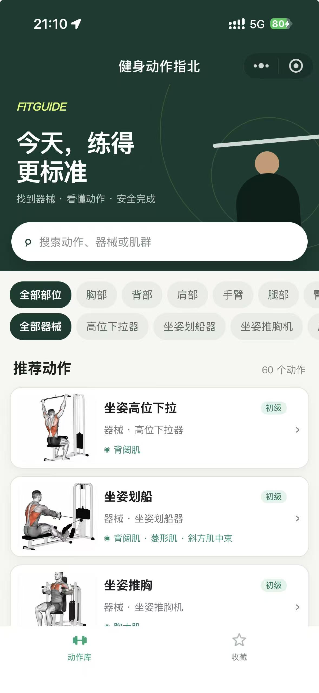

<div align="center">

# FitGuide

**面向健身新手的微信小程序：快速找到器械动作，看懂要领，安全完成训练。**

<p>
  
  
  
</p>

</div>

## 项目简介

FitGuide 是一款使用微信原生技术开发的健身动作指南小程序。用户可以按训练部位或器械筛选动作，也可以直接搜索动作、器械和肌群；进入详情页后，可查看动作演示、目标肌群、分步说明与安全提示，并将常练动作收藏到本地。

项目当前收录 **60 个动作**，覆盖 **10 个训练部位**、**48 种器械**，无需业务后端和第三方运行时依赖。

## 应用截图

<table>
  <tr>
    <th align="center">动作库</th>
    <th align="center">我的收藏</th>
  </tr>
  <tr>
    <td></td>
    <td></td>
  </tr>
</table>

> [!NOTE]
> 本小程序使用的动作静态图片与 GIF 动作演示素材均由 **Codex 生成**。

## 主要功能

- **动作检索**：按动作名称、器械名称、主要肌群和次要肌群搜索。
- **组合筛选**：训练部位与器械筛选可同时生效，并实时展示结果数量。
- **动作详情**：展示动作难度、目标肌群、动作步骤、注意事项和 GIF 演示。
- **媒体降级**：GIF 按需加载；加载失败时保留静态图，并支持重新加载。
- **本地收藏**：使用微信本地存储保存常练动作，不要求登录。
- **异常状态**：覆盖无搜索结果、图片加载失败和无效动作链接等场景。

## 技术实现

| 项目 | 说明 |
| --- | --- |
| 开发方式 | 微信原生小程序 |
| 页面与样式 | WXML、WXSS |
| 业务逻辑 | JavaScript（CommonJS） |
| 数据来源 | 本地 JSON，构建为可直接 `require` 的 JS 模块 |
| 收藏存储 | `wx.getStorageSync` / `wx.setStorageSync` |
| 动作媒体 | HTTPS 远程静态图与 GIF，详情页按需加载 |
| 第三方依赖 | 无 |

## 快速开始

### 环境要求

- [微信开发者工具](https://developers.weixin.qq.com/miniprogram/dev/devtools/download.html)
- Node.js（仅用于数据同步和检查脚本）

### 本地运行

```bash
git clone https://github.com/lfm666/FitGuide.git
cd FitGuide
node scripts/sync-exercises.js
```

随后在微信开发者工具中：

1. 选择“导入项目”，目录指向仓库根目录。
2. 按需在 `project.config.json` 中替换小程序 AppID。
3. 编译并打开“动作库”页面。

项目没有 npm 依赖，因此不需要执行 `npm install`。

### 远程媒体配置

动作图片和 GIF 托管在对象存储中。真机调试或发布前，请在微信公众平台将以下地址配置为合法下载域名，并开启域名校验：

```text
https://7072-prod-d4gi5hg2s057d6cfc-1466119943.tcb.qcloud.la
```

## 数据维护

`data/exercises.json` 是动作数据的唯一源文件，`data/exercises.js` 是供小程序运行时加载的生成文件。

修改动作数据后执行：

```bash
node scripts/sync-exercises.js
```

脚本会检查必填字段、重复 ID 和 HTTPS 媒体地址，然后重新生成 `data/exercises.js`。不要直接编辑生成文件。

每条动作数据包含以下字段：

| 字段 | 类型 | 必填 | 说明 |
| --- | --- | :---: | --- |
| `id` | `string` | 是 | 动作的唯一标识，用于详情页路由；使用稳定的 kebab-case 英文名称 |
| `name` | `string` | 是 | 展示给用户的中文动作名称 |
| `category` | `string` | 是 | 训练部位分类，例如胸部、背部、腿部或核心 |
| `equipment` | `string` | 是 | 完成动作所需的器械名称，也用于搜索和筛选 |
| `level` | `string` | 是 | 动作难度，当前使用初级或中级 |
| `primaryMuscles` | `string[]` | 是 | 动作主要刺激的肌群列表 |
| `secondaryMuscles` | `string[]` | 是 | 动作辅助刺激的肌群列表；没有时使用空数组 |
| `image` | `string` | 是 | 动作静态封面的完整 HTTPS 地址 |
| `gif` | `string` | 是 | 动作演示 GIF 的完整 HTTPS 地址，在详情页按需加载 |
| `steps` | `string[]` | 是 | 按正确顺序排列的动作执行步骤 |
| `cautions` | `string[]` | 是 | 安全注意事项和常见错误提示 |

## 项目检查

```bash
# 检查本地收藏逻辑
node scripts/test-favorites.js

# 检查全部远程 JPG 与 GIF 的状态和 Content-Type
node scripts/check-media.js
```

媒体检查需要联网，会检查当前 60 个动作对应的 120 个远程文件。

## 目录结构

```text
FitGuide/
├── assets/                 # TabBar 图标
├── data/
│   ├── exercises.json     # 动作数据源
│   └── exercises.js       # 自动生成的运行时数据
├── docs/screenshots/      # README 展示截图
├── pages/
│   ├── index/             # 搜索、筛选与动作列表
│   ├── exercise/          # 动作详情
│   └── favorites/         # 本地收藏
├── scripts/
│   ├── sync-exercises.js  # 数据校验与同步
│   ├── check-media.js     # 远程媒体检查
│   └── test-favorites.js  # 收藏逻辑检查
├── utils/                  # 筛选、查询与收藏工具
├── app.js
├── app.json
└── project.config.json
```

## 发布前检查

- 将 `project.config.json` 中的 AppID 换成正式 AppID。
- 在微信公众平台配置并验证合法下载域名。
- 同步最新动作数据，并执行收藏与媒体检查脚本。
- 在 iOS、Android 真机验证搜索、筛选、收藏和 GIF 加载。
- 确认弱网或媒体加载失败时，静态图与文字说明仍可使用。

## 素材与安全说明

本项目中的动作素材由 Codex 生成，用于动作说明和产品展示。训练内容仅供一般健身参考；首次使用器械时，请让专业教练确认座椅、限位和重量设置。如有伤病或身体不适，请先咨询医生或专业人士。
