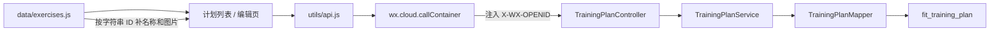

# FitGuide 训练计划功能设计

> 状态：设计基线，待实施  
> 版本：v0.1  
> 日期：2026-08-18  
> 适用范围：微信原生小程序 + 微信云托管 Spring Boot 服务 + MySQL 5.7

本文档是训练计划功能的实现基线。后续开发、测试和评审均以本文档为准；如果实现过程中需要改变数据库字段、接口契约、校验边界或页面流程，应先同步修改本文档，不允许代码和文档长期分叉。

## 1. 方案结论

首版只实现“维护计划”，不实现“执行训练”。一个微信用户可以创建多个计划；每个计划保存名称，以及一个有顺序的动作数组；数组中的每项只保存本地动作 ID 和组数。

| 决策项 | 结论 |
| --- | --- |
| 用户身份 | 继续使用微信云托管注入的 `X-WX-OPENID` |
| 动作权威数据源 | `fit-guide-miniprogram/data/exercises.js` |
| 动作 ID 类型 | 不透明字符串，绝不能转换为数字 |
| 数据库存储 | 一张 `fit_training_plan` 表，动作数组存 MySQL `JSON` |
| 动作表关联 | 不关联、不外键引用旧的 `fit_exercise` |
| 计划内动作顺序 | JSON 数组顺序即训练顺序 |
| 更新方式 | 名称和动作数组整份替换 |
| 后端接口 | 列表、新建、更新、删除，共 4 个 |
| 小程序页面 | 计划列表页、新建/编辑复用页，共 2 个 |
| 新依赖 | 不新增 Maven 或 npm 依赖 |
| 首版边界 | 顺序创建时每用户软配额 50 个计划；每计划 1～50 个动作；每动作 1～99 组 |

选择一表 JSON 的原因是：当前计划动作只会跟随计划整份读取和保存，没有按动作跨计划查询、统计或独立更新的需求。仓库已经使用 MySQL JSON 和 MyBatis-Plus `JacksonTypeHandler`，复用现有能力比增加关系表、排序列、批量 Mapper 和事务更短，也更不容易产生半更新状态。

只有出现本文第 16 节列出的真实需求时，才把动作数组拆成关系表。

## 2. 已确认的仓库现状

### 2.1 小程序

- 微信原生小程序，使用 WXML、WXSS 和 CommonJS JavaScript。
- 没有 npm 依赖、状态管理库或自定义组件目录。
- 当前页面为动作库、收藏和动作详情，路由定义在 `fit-guide-miniprogram/app.json`。
- 请求统一由 `fit-guide-miniprogram/utils/api.js` 中的 `wx.cloud.callContainer` 发出。
- 客户端不登录、不保存用户 ID，也不主动发送 OpenID；微信云托管负责注入 `X-WX-OPENID`。
- 动作目录完全在小程序本地，运行时加载 `fit-guide-miniprogram/data/exercises.js`，不再依赖后端目录接口。

### 2.2 动作 ID

截至 2026-08-18，本地目录实测结果：

- 共 1324 个动作，ID 全部唯一。
- 当前 ID 都是 4 位数字字符串，例如 `"0001"`。
- 704 个 ID 带前导零。
- 当前目录顺序不等于 ID 数字顺序。
- 所有 ID 都符合现有后端规则：长度不超过 64，且匹配 `^[a-z0-9]+(?:-[a-z0-9]+)*$`。

因此，动作 ID 在 JS、HTTP JSON、Java 和 MySQL 中都必须按字符串处理：

```text
正确："0001" → "0001" → VARCHAR("0001")
错误："0001" → 1 → VARCHAR("1")
```

动作名称、器械、肌群、图片等展示字段不进入计划表，始终从当前小程序目录按 ID 关联。

当前动作对象的实际字段只有：

```text
id, name, category, equipment, primaryMuscles, secondaryMuscles, image, gif, steps
```

当前 1324 条数据都没有 `level` 或 `cautions`。计划页面不得复制现有页面中的历史 `level` 标签，也不能假定未出现在当前数据中的字段存在。

### 2.3 后端

- JDK 21、Spring Boot 3.5.9、MyBatis-Plus 3.5.15、MySQL 5.7。
- 当前分层是 `Controller → Service → Mapper → MySQL`，不创建单实现 Service 接口或 Repository 包装层。
- 统一返回使用项目内 `Result<T>`：`{ code, message, data }`。
- 统一异常入口是现有 `CatalogExceptionHandler`，实际扫描整个 `com.fitguide`。
- 当前没有 Bean Validation、Flyway、Liquibase、Spring Security 或 `backend-components-*` 依赖。
- 收藏功能已经使用“OpenID + 本地动作字符串 ID”的数据库模式，训练计划沿用相同信任边界。

### 2.4 现有历史动作表的定位

`fit-guide-backend/sql/init.sql` 中仍有旧的 `fit_exercise` 表和 60 条历史动作，但它已经不是小程序的权威动作源。训练计划不得：

- 给动作 ID 建到 `fit_exercise.id` 的外键；
- 调用后端目录表校验动作是否存在；
- 从后端动作表补动作名称或图片；
- 把当前 4 位字符串 ID 改成数据库数值 ID。

后端只校验动作 ID 的格式。动作是否存在由小程序当前本地目录判断。

## 3. 目标、范围和非目标

### 3.1 本次实现

- 当前微信用户查看自己的全部训练计划。
- 创建多个训练计划。
- 修改计划名称。
- 给计划选择 1～50 个动作。
- 为每个动作设置 1～99 组，新增动作默认 3 组。
- 调整计划内动作顺序。
- 从计划中移除动作。
- 删除计划。
- 跨设备读取同一 OpenID 下的计划。
- 本地动作不存在时保留计划项，并显示失效占位。

### 3.2 本次不做

- 训练执行记录、打卡、计时器或完成状态。
- 次数、重量、时长、距离、休息时间、RPE 等组内参数。
- 周计划、日历排期、循环规则或提醒。
- 计划模板、复制、分享、公开市场或教练下发。
- 自动生成计划或推荐算法。
- 离线编辑、本地草稿和服务端双写。
- 拖拽排序库；首版使用上移、下移按钮。
- 分页、缓存、Redis、消息队列、分布式锁或 WebSocket。
- 单独的用户表、登录页、JWT 或手机号账号体系。
- 软删除、操作历史、乐观锁和版本冲突 UI。

## 4. 领域模型与业务规则

### 4.1 训练计划

```text
TrainingPlan
├── id: String              API 中的计划 ID
├── name: String            trim 后 1～50 个 UTF-16 字符
└── exercises: Exercise[]   1～50 项，数组顺序即训练顺序

Exercise
├── exerciseId: String      本地动作目录 ID
└── setCount: Integer       1～99
```

### 4.2 不变量

1. 计划必须属于一个有效 OpenID。
2. 计划名称 trim 后不能为空，最大 50 字符。
3. 一个计划必须至少有 1 个动作，最多 50 个动作。
4. 同一计划内同一 `exerciseId` 只能出现一次。
5. `exerciseId` 必须是字符串，最大 64 字符，并符合现有动作 ID 正则。
6. `setCount` 必须是整数，范围 1～99。
7. 客户端不能提交 OpenID、计划归属、创建时间或更新时间。
8. 客户端不能提交单独的排序值；服务端保留请求数组顺序。
9. 计划名称允许重复，不给同一用户增加名称唯一约束。
10. 计划 ID 在 API 中使用字符串，避免 JavaScript 大整数精度问题。

### 4.3 更新语义

更新请求整份替换 `name` 和 `exercises`：

```text
旧计划 = 名称 A + [动作 1, 动作 2]
PUT    = 名称 B + [动作 2, 动作 3]
结果   = 名称 B + [动作 2, 动作 3]
```

不提供“新增一个动作”“修改某一项组数”“单独排序”等细粒度接口。编辑页本来就持有完整草稿，一次保存整份计划更简单，并且单行 JSON 更新是原子的。

## 5. 总体数据流



后端响应只包含计划 ID、名称、动作 ID 和组数。小程序拿到响应后，用本地动作目录做内存关联：

```text
后端：{"exerciseId":"0001","setCount":3}
                         +
本地：{"id":"0001","name":"3/4 仰卧起坐", ...}
                         ↓
页面：动作名 + 器械 + 3 组
```

## 6. 数据库设计

### 6.1 建表 SQL

```sql
CREATE TABLE fit_training_plan (
    id           BIGINT NOT NULL AUTO_INCREMENT COMMENT '训练计划主键',
    user_openid  VARCHAR(64) CHARACTER SET ascii COLLATE ascii_bin NOT NULL
                 COMMENT '微信小程序用户OpenID',
    name         VARCHAR(50) NOT NULL COMMENT '计划名称',
    exercises    JSON NOT NULL
                 COMMENT '按训练顺序保存动作ID和组数的JSON数组',
    created_at   DATETIME(3) NOT NULL DEFAULT CURRENT_TIMESTAMP(3)
                 COMMENT '创建时间',
    updated_at   DATETIME(3) NOT NULL DEFAULT CURRENT_TIMESTAMP(3)
                 ON UPDATE CURRENT_TIMESTAMP(3) COMMENT '更新时间',
    PRIMARY KEY (id),
    KEY idx_fit_training_plan_user (user_openid, updated_at, id)
) ENGINE = InnoDB
  DEFAULT CHARSET = utf8mb4
  COLLATE = utf8mb4_general_ci
  COMMENT = '用户训练计划表';
```

`exercises` 的唯一合法结构：

```json
[
  {
    "exerciseId": "0001",
    "setCount": 3
  },
  {
    "exerciseId": "0577",
    "setCount": 4
  }
]
```

### 6.2 字段说明

| 字段 | 设计说明 |
| --- | --- |
| `id` | 数据库自增主键；Java 内部用 `Long`，API 输出为十进制字符串 |
| `user_openid` | 数据归属；ASCII 二进制排序，区分大小写，不返回客户端 |
| `name` | 只保存 trim 后的纯文本名称 |
| `exercises` | 有序聚合；只保存 `exerciseId` 和 `setCount` |
| `created_at` | 数据审计使用，首版不要求页面展示 |
| `updated_at` | 列表按最近修改倒序；首版不要求页面展示 |

### 6.3 明确不建的约束

- 不建 `fit_training_plan_exercise` 子表。
- 不建到 `fit_exercise` 的外键。
- 不建到用户表的外键，因为当前没有用户表。
- 不给计划名称建唯一索引。
- 不使用 MySQL `CHECK` 约束校验组数；MySQL 5.7 不可靠执行该约束，Service 必须校验。
- 不给 JSON 内动作 ID 建生成列或索引。

### 6.4 原子性和事务

创建、更新、删除都只修改一行：

- `INSERT` 一行；
- `UPDATE` 一行，整个 JSON 一次替换；
- `DELETE` 一行。

单条 SQL 已具备原子性，因此首版不增加 `@Transactional`。网络或进程中断不会产生“计划已更新但部分动作没更新”的中间状态。

### 6.5 初始化和已有库迁移

实施时同时维护两处：

1. 在 `fit-guide-backend/sql/init.sql` 增加建表语句，供空库初始化。
2. 新增 `fit-guide-backend/sql/add-training-plans.sql`，内容只包含上述 `CREATE TABLE`，供已有数据库执行。

仓库目前没有自动迁移框架，本功能不单独引入 Flyway 或 Liquibase。

## 7. HTTP API 契约

### 7.1 通用约定

基础路径：

```text
/api/v1/training-plans
```

所有接口必须经过微信云托管，由平台注入：

```http
X-WX-OPENID: <current-user-openid>
```

小程序不得自行设置该请求头。

成功响应继续复用现有结构：

```json
{
  "code": "00000",
  "message": "操作成功",
  "data": {}
}
```

### 7.2 查询当前用户的全部计划

```http
GET /api/v1/training-plans
```

成功响应：

```json
{
  "code": "00000",
  "message": "操作成功",
  "data": [
    {
      "id": "12",
      "name": "推日",
      "exercises": [
        { "exerciseId": "0001", "setCount": 3 },
        { "exerciseId": "0577", "setCount": 4 }
      ]
    }
  ]
}
```

规则：

- 按 `updated_at DESC, id DESC` 返回。
- 没有计划时返回 `[]`，不返回 `null`。
- 一次返回完整计划，不增加详情接口。
- 正常顺序请求下，每用户达到 50 个计划后不再允许新建，所以首版不分页。
- 50 是 Service 的软配额，不是数据库硬约束；极端并发创建可能短暂超过，列表仍须返回该用户的全部已有计划。

### 7.3 新建计划

```http
POST /api/v1/training-plans
Content-Type: application/json
```

请求体：

```json
{
  "name": "推日",
  "exercises": [
    { "exerciseId": "0001", "setCount": 3 },
    { "exerciseId": "0577", "setCount": 4 }
  ]
}
```

成功时返回创建后的完整计划，HTTP 状态保持与现有项目一致的 `200`：

```json
{
  "code": "00000",
  "message": "操作成功",
  "data": {
    "id": "12",
    "name": "推日",
    "exercises": [
      { "exerciseId": "0001", "setCount": 3 },
      { "exerciseId": "0577", "setCount": 4 }
    ]
  }
}
```

后端只从请求头确定归属。即使请求体额外包含 `openId` 或 `userOpenid`，也必须忽略且绝不使用；不允许设计任何由请求体指定计划归属的代码路径。

### 7.4 更新计划

```http
PUT /api/v1/training-plans/12
Content-Type: application/json
```

请求体与新建完全相同。成功时返回更新后的完整计划。

规则：

- 整份替换名称和动作数组。
- 两次发送相同 PUT，最终数据相同。
- SQL 条件必须同时包含 `id = ? AND user_openid = ?`。
- 不存在的 ID 和其他用户的 ID 都返回相同的 `404`，不泄露计划是否存在。

### 7.5 删除计划

```http
DELETE /api/v1/training-plans/12
```

成功响应：

```json
{
  "code": "00000",
  "message": "操作成功",
  "data": true
}
```

删除 SQL 必须同时带计划 ID 和当前 OpenID。计划不存在或不属于当前用户时统一返回 `404`。

### 7.6 错误响应

| HTTP | 业务码 | 场景 |
| ---: | --- | --- |
| `400` | `INVALID_REQUEST` | 请求体缺失、JSON 错误或字段类型无法解析 |
| `400` | `INVALID_PLAN_ID` | 计划 ID 不是正整数格式或超出 Java `Long` 范围 |
| `400` | `INVALID_TRAINING_PLAN` | 名称、动作数量、重复动作或组数不符合规则 |
| `400` | `INVALID_EXERCISE_ID` | 动作 ID 格式不合法，复用现有码 |
| `401` | `UNAUTHORIZED` | OpenID 缺失或格式错误；是否伪造由可信云托管入口保证 |
| `404` | `TRAINING_PLAN_NOT_FOUND` | 计划不存在或不属于当前用户 |
| `409` | `TRAINING_PLAN_LIMIT_REACHED` | 当前用户已有 50 个计划 |
| `415` | `INVALID_REQUEST` | 请求体不是支持的 JSON Content-Type |
| `500` | `INTERNAL_ERROR` | 未预期服务异常 |

错误响应示例：

```json
{
  "code": "INVALID_TRAINING_PLAN",
  "message": "每个计划需要包含 1 到 50 个动作",
  "data": null
}
```

不要向客户端返回 SQL、表名、完整 OpenID 或异常堆栈。

## 8. 后端代码设计

### 8.1 包结构

新增最少文件：

```text
com.fitguide.plan/
├── controller/TrainingPlanController.java
├── dto/TrainingPlanModels.java
├── entity/TrainingPlanEntity.java
├── exception/TrainingPlanApiException.java
├── mapper/TrainingPlanMapper.java
└── service/TrainingPlanService.java
```

测试文件：

```text
src/test/java/com/fitguide/plan/TrainingPlanApiTest.java
```

不增加以下层次：

- `TrainingPlanService` 接口；
- Repository 包装；
- Converter、Assembler 或 Factory；
- 单独的动作项 Service/Mapper；
- 通用 CRUD 基类。

### 8.2 DTO

三个短 record 放在一个模型文件中，避免为每个两字段对象拆文件：

```java
public final class TrainingPlanModels {

    private TrainingPlanModels() {
    }

    public record Exercise(String exerciseId, int setCount) {
    }

    public record SaveRequest(String name, List<Exercise> exercises) {
    }

    public record Response(String id, String name, List<Exercise> exercises) {
    }
}
```

`SaveRequest` 不包含 `id`、`openId`、时间或排序字段，并且只表示严格解析后的内部命令，不直接作为 Spring `@RequestBody` 的绑定目标。

原因是 Jackson 默认允许部分标量强制转换：如果直接绑定 `String exerciseId` 和 `Integer setCount`，客户端提交的数值 ID、字符串组数或小数组数可能在 Service 校验前被转换。动作 ID 保真要求本接口严格检查原始 JSON 类型，因此 Controller 接收 `JsonNode`，Service 按以下规则解析后才创建 `SaveRequest`：

```java
private static SaveRequest parseRequest(JsonNode body) {
    if (body == null || !body.isObject()) {
        throw TrainingPlanApiException.invalidRequest();
    }
    var name = body.get("name");
    var exercises = body.get("exercises");
    if (name == null || !name.isTextual()
            || exercises == null || !exercises.isArray()) {
        throw TrainingPlanApiException.invalidRequest();
    }

    var parsed = new ArrayList<Exercise>();
    for (var item : exercises) {
        if (item == null || !item.isObject()) {
            throw TrainingPlanApiException.invalidRequest();
        }
        var exerciseId = item.get("exerciseId");
        var setCount = item.get("setCount");
        if (exerciseId == null || !exerciseId.isTextual()
                || setCount == null || !setCount.isIntegralNumber()
                || !setCount.canConvertToInt()) {
            throw TrainingPlanApiException.invalidRequest();
        }
        parsed.add(new Exercise(exerciseId.textValue(), setCount.intValue()));
    }
    return new SaveRequest(name.textValue(), List.copyOf(parsed));
}
```

这段解析同时覆盖 `null` 请求体、`exercises: null`、数组中的 `null` 项，以及缺失的 `exerciseId`/`setCount`，避免 NPE 落入 `500`。结构和原始类型通过后，Service 再校验名称长度、数组数量、ID 格式、重复 ID 和组数范围。未知字段会被丢弃，尤其不能使用请求体中的 `openId` 或 `userOpenid`。

### 8.3 Entity 和 JSON 映射

复用仓库现有的 `JacksonTypeHandler`：

```java
@Data
@TableName(value = "fit_training_plan", autoResultMap = true)
public class TrainingPlanEntity {

    @TableId(type = IdType.AUTO)
    private Long id;

    private String userOpenid;
    private String name;

    @TableField(typeHandler = JacksonTypeHandler.class)
    private List<TrainingPlanModels.Exercise> exercises;

    private LocalDateTime createdAt;
    private LocalDateTime updatedAt;
}
```

Mapper 不写自定义 SQL：

```java
@Mapper
public interface TrainingPlanMapper extends BaseMapper<TrainingPlanEntity> {
}
```

所有查询和修改使用 MyBatis-Plus 参数化 Wrapper，不拼接用户输入。

### 8.4 Service 职责

`TrainingPlanService` 只承担以下职责：

1. 校验 OpenID。
2. 解析计划 ID。
3. 严格解析原始 JSON，并校验、规范化名称和动作数组。
4. 查询当前用户计划。
5. 创建、整份更新和删除一行计划。
6. 把数据库 `Long` ID 转成 API 字符串。

核心方法签名：

```java
public List<Response> getPlans(String openId)
public Response createPlan(String openId, JsonNode body)
public Response updatePlan(String openId, String planId, JsonNode body)
public boolean deletePlan(String openId, String planId)
```

查询必须按归属过滤：

```java
mapper.selectList(Wrappers.<TrainingPlanEntity>lambdaQuery()
        .eq(TrainingPlanEntity::getUserOpenid, openId)
        .orderByDesc(TrainingPlanEntity::getUpdatedAt)
        .orderByDesc(TrainingPlanEntity::getId));
```

更新前先用 `id + user_openid` 查询目标计划；不存在时返回 `TRAINING_PLAN_NOT_FOUND`。随后仍使用相同的两个条件执行 UPDATE。如果 UPDATE 返回 0，再按相同归属条件查询：记录仍存在表示同值幂等更新成功，记录已不存在才返回 `404`。这也覆盖预查询后被另一设备删除的竞态。

JSON 更新必须把规范化后的名称和动作设置到一个 patch entity，再让实体字段上的类型处理器生效：

```java
var patch = new TrainingPlanEntity();
patch.setName(request.name());
patch.setExercises(request.exercises());
mapper.update(patch, Wrappers.<TrainingPlanEntity>lambdaUpdate()
        .eq(TrainingPlanEntity::getId, id)
        .eq(TrainingPlanEntity::getUserOpenid, openId));
```

不要使用普通 `lambdaUpdate().set(TrainingPlanEntity::getExercises, value)` 写 JSON；该写法可能绕过实体字段声明的 `JacksonTypeHandler`。

更新和删除必须同时按计划 ID 与 OpenID 过滤：

```java
.eq(TrainingPlanEntity::getId, id)
.eq(TrainingPlanEntity::getUserOpenid, openId)
```

不能使用只带 `id` 的 `updateById` 或 `deleteById`，否则猜到计划 ID 的用户可能修改他人数据。

### 8.5 复用现有校验

- 动作 ID 继续复用 `CatalogService.validateExerciseId`，但不调用 `requireAvailableExercise`。
- OpenID 校验规则继续复用收藏功能的 `[A-Za-z0-9_-]{1,64}` 规则。
- 实施时把 `FavoriteService.requireOpenId` 调整为可复用的静态方法，避免复制正则；首版不为它增加认证框架或参数解析器。
- 计划名称、动作数量、重复 ID 和组数在 `TrainingPlanService` 手工校验，因为项目目前没有 Bean Validation 依赖。

创建时的每用户 50 个计划软配额使用一次 `COUNT` 检查。该限制主要防止误操作和普通滥用；顺序请求的第 51 次创建返回 `409`，极端并发可能短暂超过 50，不为当前未提出的严格配额增加锁：

```java
// ponytail: soft quota; add a DB-backed quota only if concurrent abuse appears.
```

### 8.6 Controller

Controller 只读请求、调用 Service、包装 `Result`：

```java
@RestController
@RequestMapping("/api/v1/training-plans")
public class TrainingPlanController {

    @GetMapping
    Result<List<Response>> getPlans(...)

    @PostMapping
    Result<Response> createPlan(..., @RequestBody JsonNode body)

    @PutMapping("/{planId}")
    Result<Response> updatePlan(..., @RequestBody JsonNode body)

    @DeleteMapping("/{planId}")
    Result<Boolean> deletePlan(...)
}
```

`X-WX-OPENID` 仍使用 `required = false`，交给 Service 统一转换为 `401`，避免 Spring 在业务异常处理之前生成不同格式的错误。

### 8.7 异常处理

新增 `TrainingPlanApiException`，形态与现有 `FavoriteApiException` 一致，携带 `HttpStatus + code + message`。

在现有 `CatalogExceptionHandler` 增加：

- `TrainingPlanApiException` 映射；
- `HttpMessageNotReadableException → 400 / INVALID_REQUEST`；
- `HttpMediaTypeNotSupportedException → 415 / INVALID_REQUEST`。

后两项是必需的：训练计划是仓库第一个主要使用 JSON 请求体的业务，如果不显式处理，坏 JSON 或错误 Content-Type 可能落入当前 `Throwable` 兜底并错误返回 `500`。

## 9. 小程序代码设计

### 9.1 页面与导航

在 `fit-guide-miniprogram/app.json` 注册：

```text
pages/plans/plans   第三个 Tab，计划列表
pages/plan/edit     新建和编辑复用页
```

TabBar 新增：

```text
文字：计划
普通图标：assets/tabbar/plan.png
选中图标：assets/tabbar/plan-active.png
```

首版不建单独的计划详情页和动作选择页。

### 9.2 计划列表页

文件：

```text
pages/plans/plans.js
pages/plans/plans.json
pages/plans/plans.wxml
pages/plans/plans.wxss
```

页面草图：

```text
┌────────────────────────────┐
│ 我的训练计划       [新建计划] │
├────────────────────────────┤
│ 推日                         │
│ 4 个动作 · 卧推 / 上斜推胸…  │
│                    [编辑] [删]│
├────────────────────────────┤
│ 拉日                         │
│ 5 个动作 · 高位下拉 / 划船…  │
└────────────────────────────┘
```

页面状态：

```js
data: {
  plans: [],
  loading: true,
  loadFailed: false,
  deletingPlanId: ''
}
```

交互规则：

- `onShow` 使用 `Promise.all([getTrainingPlans(), getCatalog()])` 同时取得计划和本地目录，关联后再渲染；每次重新加载可保证编辑返回和跨设备数据可见。
- 新建跳转 `/pages/plan/edit`。
- 编辑跳转 `/pages/plan/edit?id=<encoded-plan-id>`。
- 删除使用原生 `wx.showModal` 二次确认。
- 删除期间只禁用对应计划按钮。
- 加载失败保留重试按钮，不展示旧列表冒充最新数据。
- 空状态显示“还没有训练计划”和“新建计划”入口。
- 卡片只展示名称、动作数和前 3 个动作名，不展示不存在的 `level` 字段。

### 9.3 新建/编辑页

文件：

```text
pages/plan/edit.js
pages/plan/edit.json
pages/plan/edit.wxml
pages/plan/edit.wxss
```

页面同时包含编辑区和可展开的动作选择区：

```text
┌────────────────────────────┐
│ 计划名称 [推日____________] │
├────────────────────────────┤
│ 1. 器械推胸   [-] 3 组 [+] │
│    [上移] [下移] [移除]     │
│ 2. 绳索夹胸   [-] 4 组 [+] │
│    [上移] [下移] [移除]     │
├────────────────────────────┤
│ [添加动作]          [保存]  │
└────────────────────────────┘

添加动作后在本页展开：

┌────────────────────────────┐
│ 搜索动作、器械或肌群         │
│ [全部部位] [胸部] [背部] ... │
│ [ ] 0001  3/4 仰卧起坐       │
│ [✓] 0577  杠杆式器械推胸     │
│             [取消] [完成选择]│
└────────────────────────────┘
```

页面状态：

```js
data: {
  planId: '',
  name: '',
  items: [],
  loading: false,
  loadFailed: false,
  notFound: false,
  saving: false,
  selecting: false,
  selectorQuery: '',
  selectorCategory: '全部',
  selectorEquipment: '全部器械',
  selectorExercises: []
}
```

页面实例中保存不直接渲染的数据：

```js
this.catalogExercises       // 完整本地动作数组
this.pendingExerciseIds     // 本次选择中新勾选的 Set
this.pendingSelectionOrder  // 本次新动作的点击顺序
```

### 9.4 编辑规则

- 新建页初始没有动作；保存前要求至少选择 1 个。
- 新选择的动作默认 `setCount = 3`。
- 同一动作不能重复添加。
- 组数减到 1 后减号禁用，加到 99 后加号禁用。
- 数字输入在失焦或保存时转换为整数并校验，非法值不提交。
- 使用上移、下移按钮改变 `items` 数组顺序，不引入拖拽库。
- 保存期间设置 `saving = true`，快速双击只发送一次请求。
- 服务明确返回业务错误时保留当前草稿，用户修正后再提交。
- 编辑已有计划的 PUT 在网络失败后可以直接重试，整份替换结果仍相同。
- 新建计划的 POST 如果发生无响应、超时或断网，数据库可能已经写入但客户端没收到结果。此时不能自动重试；应保留草稿并提示用户先返回计划列表刷新确认。首版没有幂等请求键，用户手动再次提交仍可能产生重复计划，可在列表中删除。
- 保存成功后通常 `wx.navigateBack()`，列表页由 `onShow` 重新加载；如果编辑页是直接入口且没有上一页，则使用 `wx.switchTab({ url: '/pages/plans/plans' })` 兜底。
- 不自动保存，不写 `wx.setStorageSync`，避免本地和服务端双数据源。

编辑已有计划时，页面调用 `getTrainingPlans()`，按字符串计划 ID 查找目标计划。找不到时设置 `notFound = true`，展示“计划不存在或已删除”，禁用保存并提供返回计划列表的按钮；不能回退成新建空白页。首版不为此增加单独详情接口；普通用户的计划规模由 50 个软配额控制。

### 9.5 动作选择规则

- 直接读取本地 `getCatalog()`、`getCategories()` 和 `getEquipments()`。
- 搜索和部位/器械组合筛选复用 `utils/exercises.js` 的 `filterExercises()`。
- 分类使用 `getCategories()` 的动态结果，不依赖已经与当前数据不完全一致的静态 `categoryOrder`。
- 选择列表使用轻量文本行，不加载 1324 张图片。
- 已在计划中的动作显示为已勾选、“已添加”并禁用；移除已有动作只能回到编辑区操作。
- 打开选择区时创建空的临时 `pendingExerciseIds` 和 `pendingSelectionOrder`，不直接修改 `items`。
- 每行点击只切换当前动作在临时 `Set` 中的状态，然后重算当前 `selectorExercises[].checked`；不能用当前筛选结果的 `checkbox-group` value 覆盖整个 Set。
- 切换搜索、部位或器械后，根据临时 Set 重新生成勾选状态，不能丢失其他筛选条件下的新选择。
- 达到 50 个动作后阻止继续选择并提示上限。
- “完成选择”时保留现有动作顺序，按 `pendingSelectionOrder` 追加仍在临时 Set 中的新动作。
- 取消选择清空临时 Set 和点击顺序，不修改当前编辑草稿。

### 9.6 本地动作关联和失效动作

在 `fit-guide-miniprogram/utils/exercises.js` 增加一个小函数，列表页和编辑页共同复用：

```js
function hydratePlanExercises(items, exercises) {
  const byId = new Map(exercises.map((exercise) => [exercise.id, exercise]))
  return items.map((item) => ({
    ...item,
    exercise: byId.get(item.exerciseId) || null,
    missing: !byId.has(item.exerciseId)
  }))
}
```

找不到本地动作时必须：

- 保留原 `exerciseId` 和 `setCount`；
- 显示 `动作已失效（9999）`；
- 禁止跳转动作详情；
- 允许用户移除；
- 如果用户未移除，下一次保存仍原样带回，不能静默丢数据。

计划列表不能照搬收藏页的 `.filter(({ id }) => favoriteIds.includes(id))` 后直接丢弃未知 ID 的做法。

### 9.7 API 封装

把现有请求函数最小扩展为支持请求体：

```js
async function request(path, method = 'GET', data) {
  const options = {
    config: { env: ENV_ID },
    path,
    method,
    header: {
      'X-WX-SERVICE': SERVICE_NAME,
      'content-type': 'application/json'
    }
  }
  if (data !== undefined) options.data = data
  const response = await wx.cloud.callContainer(options)
  const body = response && response.data

  if (!response || response.statusCode < 200 || response.statusCode >= 300
      || !body || body.code !== '00000') {
    const error = new Error((body && body.message) || '服务请求失败，请稍后重试')
    error.code = (body && body.code) || 'REQUEST_FAILED'
    throw error
  }

  return body.data
}
```

新增导出：

```js
async function getTrainingPlans() {
  const plans = await request('/api/v1/training-plans')
  const invalid = !Array.isArray(plans) || plans.some((plan) => (
    !plan || typeof plan.id !== 'string' || typeof plan.name !== 'string'
    || !Array.isArray(plan.exercises)
    || plan.exercises.some((item) => (
      !item || typeof item.exerciseId !== 'string'
      || !Number.isInteger(item.setCount)
    ))
  ))
  if (invalid) throw new Error('训练计划数据格式错误')
  return plans
}

function createTrainingPlan(plan) {
  return request('/api/v1/training-plans', 'POST', plan)
}

function updateTrainingPlan(id, plan) {
  return request(`/api/v1/training-plans/${encodeURIComponent(id)}`, 'PUT', plan)
}

function deleteTrainingPlan(id) {
  return request(`/api/v1/training-plans/${encodeURIComponent(id)}`, 'DELETE')
}
```

客户端请求体只能从编辑状态重新构造：

```js
const exercises = this.data.items.map(({ exerciseId, setCount }) => ({
  exerciseId,
  setCount: Number(setCount)
}))
if (exercises.some(({ setCount }) => (
  !Number.isInteger(setCount) || setCount < 1 || setCount > 99
))) return

const payload = {
  name: this.data.name.trim(),
  exercises
}
```

不要把本地完整动作对象、图片地址、`missing` 或选择器状态提交给后端。

格式不符时不能把服务端数值 ID 静默转换成字符串。

### 9.8 可访问性和安全区

- 新建、编辑、删除、组数加减、上移、下移和动作选择都使用原生 `<button>`，不要只给 `<view>` 绑定点击事件。
- 每个图标按钮提供明确的 `aria-label`，例如“增加杠杆式器械推胸组数”。
- 计划名称输入框提供 `aria-label="计划名称"`，错误提示不能只依赖颜色。
- 禁用按钮同时设置 `disabled`，不能只改变透明度。
- 页面底部继续复用全局 `.safe-bottom`，避免操作按钮被系统安全区遮挡。

## 10. 动作 ID 治理

训练计划能长期成立的前提是动作 ID 稳定。后续更新本地动作目录必须遵守：

1. ID 是持久标识，不是展示序号。
2. 已发布 ID 不改名、不复用给另一个动作。
3. 展示顺序变化不能修改 ID。
4. 删除动作后允许计划出现失效占位，不能把旧 ID 指向新动作。
5. 动作 ID 集或内容发生发布级变化时递增目录 `version`。
6. 不在计划中保存 `catalogVersion`；版本号不能解决已删除 ID，只用于识别目录发布批次。

实施训练计划时，补强 `fit-guide-miniprogram/scripts/sync-exercises.js` 的 ID 校验：

```text
typeof id === "string"
1 <= id.length <= 64
匹配 ^[a-z0-9]+(?:-[a-z0-9]+)*$
全目录唯一
```

语法和唯一性校验不能发现“上游把旧 ID 复用给了另一个动作”。每次发布动作目录还必须执行旧版与新版的稳定性对比：

1. 以上一个正式发布版本的 `fit-guide-miniprogram/data/exercises.json` 为基线。
2. 输出新增 ID、删除 ID，以及同 ID 下源媒体标识发生变化的列表。
3. 新增允许；删除必须确认计划页将出现失效占位。
4. 同 ID 的图片/GIF 源文件标识同时变化时必须人工确认动作身份，确认是 ID 复用则阻止发布。
5. ID 集、动作身份或发布内容发生变化时，新 `version` 必须大于旧版本。

实施时新增一个无依赖的 `fit-guide-miniprogram/scripts/check-exercise-id-stability.js`，接收上一发布版和本次候选 JSON 两个路径并生成上述差异；它不能仅比较名称，因为中文翻译调整不代表动作身份变化。

目录版本的唯一源头定为 `assets/exercises-dataset/scripts/build-exercises-zh.mjs` 中的 `CATALOG_VERSION` 常量。当前脚本在输出对象中硬编码 `version: 1`，正式实施前改为 `CATALOG_VERSION = 2`，然后按现有数据链生成或同步：

```text
build-exercises-zh.mjs / CATALOG_VERSION
                  ↓
assets/exercises-dataset/data/exercises-zh.json
                  ↓ 复制
fit-guide-miniprogram/data/exercises.json
                  ↓ sync-exercises.js
fit-guide-miniprogram/data/exercises.js
```

`sync-exercises.js` 校验 `version` 是正整数，但不自行修改版本。当前 1324 条数据和此前旧 60 条后端数据使用了不同 ID 集，本地版本却仍是 `1`，所以训练计划正式发布前必须完成上述版本 2 构建和稳定性报告。计划表本身仍不保存版本或动作快照。

## 11. 安全、一致性和失败处理

### 11.1 身份边界

- 只信任微信云托管注入或覆盖的 `X-WX-OPENID`。
- 小程序不传 OpenID，API 请求体也没有用户字段。
- 如果后端可以绕过云托管被公网直接访问，请求头可被伪造；部署必须阻断这种入口。
- 如果未来开放 H5、App 或第三方客户端，再引入真正登录态或 JWT，不能继续信任普通请求头。

### 11.2 用户隔离

- 列表查询只使用当前 OpenID。
- 更新和删除同时使用计划 ID 与当前 OpenID。
- 他人计划和不存在计划统一返回 `404`。
- OpenID 不进入普通业务日志，不返回客户端。

### 11.3 一致性

- 一行 JSON 更新保证计划聚合原子替换。
- 客户端服务端保存成功后才离开编辑页。
- 网络失败保留编辑草稿，不做乐观页面成功和回滚；POST 结果不明确时先刷新列表确认，不自动重试。
- 两台设备同时修改同一计划时首版采用最后写入者覆盖。
- 不增加乐观锁；真实出现并发覆盖问题时再按第 16 节升级。

### 11.4 数据兼容

- 后端不检查动作是否存在于旧动作表。
- 客户端对未知动作显示占位并保留原数据。
- 后端返回的计划 ID 和动作 ID 都按字符串处理。
- WXML 使用普通文本绑定，不使用 `rich-text` 渲染计划名称。

## 12. 组件和依赖决策

### 12.1 推荐模块

本功能不新增 `backend-components-*` 模块，继续使用项目已安装的 Spring MVC、MyBatis-Plus、Jackson、MySQL 驱动和本地 `Result`。

### 12.2 适用原因

- `backend-components-database` 的核心能力当前已经由已安装的 MyBatis-Plus 覆盖。
- `backend-components-foundation` 会与当前项目本地 `Result` 重复。
- `backend-components-validation` 需要新增依赖，而本功能只有少量明确的手工校验。
- `backend-components-security` 面向 JWT 资源服务器，不能替代微信云托管的可信 OpenID 注入。
- JSON 类型处理器已经在 `ExerciseEntity` 使用，无须自写序列化器。

### 12.3 Maven 依赖

`fit-guide-backend/pom.xml` 无需修改。

### 12.4 配置项

`application.yml` 无需新增配置。计划数量、动作数量和组数上限是当前业务不变量，先作为代码常量，不为不会动态变化的值增加配置项。

### 12.5 最小接入代码

复用方式如下：

```text
Result<T>                  统一响应
CatalogService            动作 ID 格式校验
FavoriteService           OpenID 格式校验
JacksonTypeHandler        JSON 动作数组
MyBatis-Plus Wrapper      带 OpenID 的安全查询和修改
CatalogExceptionHandler   统一异常响应
```

### 12.6 常见坑

1. 把 `"0001"` 转为数值会永久丢失前导零。
2. 只按计划 ID 更新或删除会造成越权。
3. 把计划动作外键连到旧 `fit_exercise` 会拒绝大部分当前本地动作。
4. 直接持久化完整动作对象会造成目录和计划双数据源。
5. 坏 JSON 未单独处理时会被当前兜底异常错误映射为 `500`。
6. 未开启 `autoResultMap = true` 时 JSON 类型处理器不会按预期工作。

### 12.7 后续组合建议

只有项目整体迁移到共享组件体系时，再统一替换本地 `Result`、异常处理、Validation 和数据库配置。不要只为训练计划孤立引入一套与现有代码并行的基础设施。

## 13. 测试设计

### 13.1 后端自动检查

新增一个 `TrainingPlanApiTest`，沿用现有 `MockMvcBuilders.standaloneSetup + Mockito` 风格，至少覆盖：

1. 缺少 OpenID 返回 `401 / UNAUTHORIZED`。
2. 不同 OpenID 只返回自己的计划。
3. 新建后 `"0001"` 仍是字符串并保留前导零。
4. 空名称、超长名称、空动作、超过 50 个动作被拒绝。
5. 重复动作 ID 被拒绝。
6. 非法动作 ID 被拒绝。
7. `setCount` 为 `null`、`0`、`100` 被拒绝。
8. `exerciseId: 1`、`setCount: 3.5`、`setCount: "3"` 都返回 `400`，不能被 Jackson 静默强转。
9. 请求体为 `null`、`exercises: null` 或 `exercises: [null]` 时返回 `400`，不能变成 `500`。
10. 更新 SQL 条件同时包含计划 ID 和 OpenID。
11. 相同 payload 连续 PUT 两次，两次都返回 `200`。
12. 猜测他人计划 ID 的更新和删除返回 `404`。
13. 顺序创建时第 51 个计划返回 `409`；该测试不声称并发下是数据库硬配额。
14. 坏 JSON 返回 `400 / INVALID_REQUEST`，错误 Content-Type 返回 `415`，都不能变成 `500`。
15. 删除成功返回 `true`。

JSON 类型映射需要至少一次连接 MySQL 5.7 的人工或部署环境冒烟检查：插入、读取、更新一条包含两个动作的计划，确认字段反序列化为 `List<Exercise>`。

### 13.2 小程序自动检查

扩展 `fit-guide-miniprogram/scripts/test-api.js`：

- 断言 GET、POST、PUT、DELETE 的路径和方法。
- 断言 POST、PUT 请求体只含 `name` 和 `exercises`。
- 断言 `"0001"` 在请求体中仍为字符串。
- 继续断言客户端没有设置 `X-WX-OPENID`。
- 断言非 `00000` 响应仍转换为带 `error.code` 的异常。

新增一个最小的 `scripts/test-training-plans.js`，覆盖：

- 本地动作 ID 关联。
- 未知动作保留为 `missing`，不被过滤。
- 新动作默认 3 组。
- 同一动作不能重复加入。
- 上移、下移后保存数组顺序正确。
- 保存中重复点击只请求一次。
- 保存失败保留当前编辑项。
- 新建请求出现无响应时不自动发送第二次 POST，而是提示刷新计划列表确认。

补强 `sync-exercises.js` 后，现有同步脚本继续承担动作 ID 类型、格式和唯一性校验。`check-exercise-id-stability.js` 使用一份最小旧/新目录样例验证新增、删除、疑似 ID 复用和版本未递增都能得到预期报告或失败结果。

### 13.3 手工验收

- 微信开发者工具创建、编辑、删除计划。
- iOS 和 Android 真机验证输入框、组数按钮、长列表滚动和 TabBar。
- 使用两个不同 OpenID 验证计划完全隔离。
- 在一台设备创建后，在另一台同 OpenID 设备查看。
- 模拟弱网和 500 错误，确认草稿不丢。
- 模拟 POST 已写入但客户端未收到响应，确认页面不自动重试并引导刷新列表。
- 两台设备同时编辑同一计划，确认首版是已知的最后写入者覆盖，不误以为会自动合并。
- 临时把一个计划动作 ID 改成本地不存在值，确认页面显示失效占位并可移除。

## 14. 验收标准

| 编号 | 验收项 | 通过条件 |
| --- | --- | --- |
| TP-01 | 多计划 | 同一用户可创建并看到多个计划 |
| TP-02 | 用户隔离 | 不同 OpenID 不能读写对方计划 |
| TP-03 | ID 保真 | `"0001"` 经 JS、HTTP、Java、MySQL 往返后不变 |
| TP-04 | 动作顺序 | 保存和重新加载后顺序与编辑页一致 |
| TP-05 | 组数 | 每项独立保存 1～99 的整数组数 |
| TP-06 | 去重 | 同一计划不能包含两个相同动作 ID |
| TP-07 | 原子更新 | 更新失败时旧计划不会只改一半 |
| TP-08 | 失效动作 | 本地找不到动作时仍显示 ID、组数和删除入口 |
| TP-09 | 防重复提交 | 保存中连续点击只发送一次请求 |
| TP-10 | 错误契约 | 业务错误使用统一 `Result`，坏请求不返回 500 |
| TP-11 | 依赖 | Maven 和小程序均不新增第三方依赖 |
| TP-12 | 文档一致 | 实际表、接口、字段和限制与本文档一致 |

## 15. 实施顺序与文件清单

建议按以下顺序开发，每一步都有可运行检查：

1. 数据库建表和 Entity JSON 映射冒烟。
2. 后端 DTO、Mapper、Service、Controller 和异常处理。
3. 后端 MockMvc 测试。
4. 小程序 `api.js` 请求体与四个接口封装。
5. 计划列表页。
6. 新建/编辑页及本页动作选择。
7. 动作 ID 同步校验和小程序脚本测试。
8. 真机和双用户验收。

预计变更：

```text
新增：
fit-guide-backend/docs/training-plan-design.md
fit-guide-backend/sql/add-training-plans.sql
fit-guide-backend/src/main/java/com/fitguide/plan/controller/TrainingPlanController.java
fit-guide-backend/src/main/java/com/fitguide/plan/dto/TrainingPlanModels.java
fit-guide-backend/src/main/java/com/fitguide/plan/entity/TrainingPlanEntity.java
fit-guide-backend/src/main/java/com/fitguide/plan/exception/TrainingPlanApiException.java
fit-guide-backend/src/main/java/com/fitguide/plan/mapper/TrainingPlanMapper.java
fit-guide-backend/src/main/java/com/fitguide/plan/service/TrainingPlanService.java
fit-guide-backend/src/test/java/com/fitguide/plan/TrainingPlanApiTest.java
fit-guide-miniprogram/pages/plans/plans.js
fit-guide-miniprogram/pages/plans/plans.json
fit-guide-miniprogram/pages/plans/plans.wxml
fit-guide-miniprogram/pages/plans/plans.wxss
fit-guide-miniprogram/pages/plan/edit.js
fit-guide-miniprogram/pages/plan/edit.json
fit-guide-miniprogram/pages/plan/edit.wxml
fit-guide-miniprogram/pages/plan/edit.wxss
fit-guide-miniprogram/assets/tabbar/plan.png
fit-guide-miniprogram/assets/tabbar/plan-active.png
fit-guide-miniprogram/scripts/check-exercise-id-stability.js
fit-guide-miniprogram/scripts/test-training-plans.js

修改：
assets/exercises-dataset/scripts/build-exercises-zh.mjs
assets/exercises-dataset/data/exercises-zh.json
fit-guide-backend/sql/init.sql
fit-guide-backend/src/main/java/com/fitguide/catalog/controller/CatalogExceptionHandler.java
fit-guide-backend/src/main/java/com/fitguide/favorite/service/FavoriteService.java
fit-guide-miniprogram/app.json
fit-guide-miniprogram/data/exercises.json
fit-guide-miniprogram/data/exercises.js
fit-guide-miniprogram/utils/api.js
fit-guide-miniprogram/utils/exercises.js
fit-guide-miniprogram/scripts/sync-exercises.js
fit-guide-miniprogram/scripts/test-api.js
```

不修改：

```text
fit-guide-backend/pom.xml
fit-guide-backend/src/main/resources/application.yml
fit-guide-miniprogram/app.js
现有动作详情页和收藏页
```

## 16. 何时升级设计

### 16.1 拆动作关系表

出现以下任一已确认需求时，再把 JSON 拆为 `fit_training_plan_exercise`：

- 需要用 SQL 查询“哪些计划包含某个动作”；
- 需要按动作统计计划数、训练量或热门程度；
- 需要只更新一项动作而不提交整份计划；
- 单计划动作明显超过当前 50 项上限；
- 动作项增加大量独立字段并需要数据库索引。

届时关系表至少包含 `plan_id`、`exercise_id`、`set_count` 和 `sort_order`，并通过 `plan_id` 外键级联删除；仍然不外键关联本地动作目录。

### 16.2 增加乐观锁

只有真实出现多设备并发编辑覆盖时，再给计划增加 `version` 字段，并要求 PUT 携带版本。当前最后写入者覆盖足以支持普通个人计划编辑。

### 16.3 增加训练执行模型

当用户需要打卡、重量、次数、时长或历史趋势时，新增独立的训练会话和训练记录表，不把执行数据继续塞进计划 JSON。计划描述“准备怎么练”，记录描述“实际练了什么”，两者职责必须分开。

### 16.4 增加统一认证或共享组件

当服务不再只通过微信云托管访问，或者项目整体开始使用统一基础组件时，再统一引入认证、共享 `Result`、Validation 和数据库组件。首版不为假设中的客户端提前建设两套基础设施。
